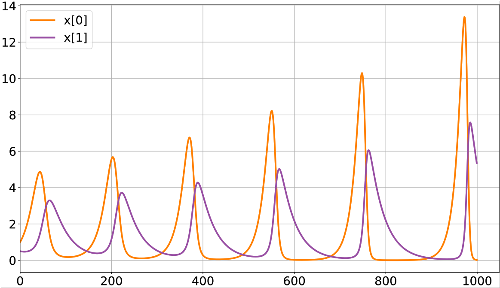
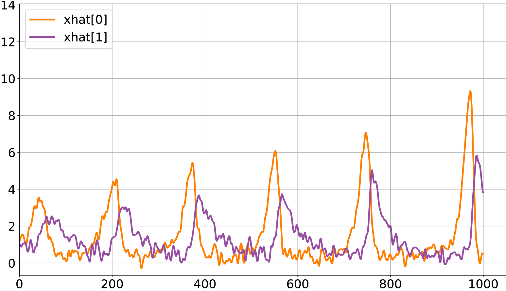
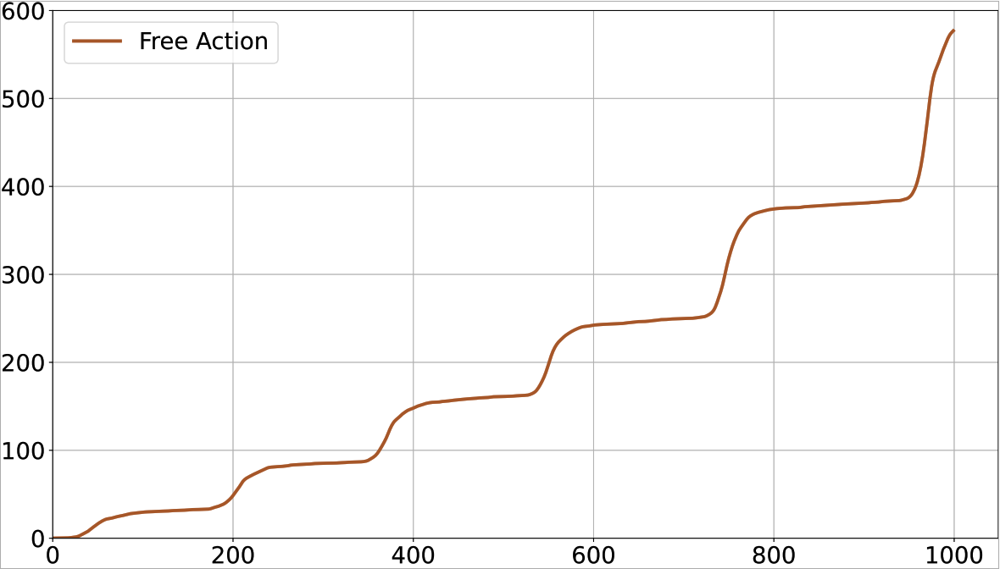

# Implementation of a One-Layer Predictive Coding (PC) Network under the Free Energy Principle (FEP)
This is a Python/Pytorch package, where the neuronal message-passing in a one-layer Predictive Coding (PC) network has
implemented using Python and Pytorch running on CPU.
---
<h3 style="text-align: center;">Hidden State Inference using a One-Layer Predictive Coding Network</h3>

<table>
  <tr>
    <td style="text-align: center;">
      
      <figcaption>Hidden state x</figcaption>
    </td>
    <td style="text-align: center;">
      
      <figcaption>Inferred state xhat</figcaption>
    </td>
    <td style="text-align: center;">
      
      <figcaption>Evolution of Free Action during inference</figcaption>
    </td>
  </tr>
</table>


---
# Installing required packages
Go to the directory of your choice where you would like to clone the repository:
```commandline
cd MY_DIRECTORY
```
Then clone the repository on your machine:
```commandline
git clone https://github.com/MLDawn/PC-network-NeurIPs-2024.git
```
Go inside the cloned repository:

```commandline
cd PC-network-NeurIPs-2024/
```
Create a conda environment with your name of choice, **_ENVIRONMENT_NAME_**, with Python version 3.11.5:
```commandline
conda create -n ENVIRONMENT_NAME python == 3.11.5 
```
Activate the created environment:
```commandline
conda activate ENVIRONMENT_NAME
```
Using the provided _**requirements.txt**_ file, install all the necessary packages (This will take a while):
```commandline
pip install -r requirements.txt 
```
---
# Running the code
1 - Open the **_parameters.yaml_** file and set your configuration for the PC network.
  - **NOTE**: The current configuration in the _.yaml_ file will reproduce the results for generative model M1 from our paper which has a _'pullback'_ attractor as the flow of state dynamics.
  - **NOTE**: If you would like to reproduce the results for generative model M2, simply set the value of _dynamics_ to _'trigonometric'_ in the _.yaml_ file.

2 - Open the project in an IDE (e.g., Pycharm).

3 - Assign **_ENVIRONMENT_NAME_** as the Python interpreter to this project in your IDE.

4 - Run **_main.py_**.

Now the state inference cycle for the _Lotka-Volterra_ generative process begins. You should see the following where
Given each observation, _y_i_, the accumulated free action up to that point as well as the Variational Free Energy at that
time are computed and printed.

---

# The outputs of the code
After the entire cycle of inference has finished, the results are stored under ./results in a subdirectory whose name has this format (kx,ky,gp_name,f_name,g_name,fa,mse):

- _**gp_name**_: The name of the Generative Process (e.g., '_lotka_' which is short for Lotka-Volterra).


- _**f_name**_: The name of the dynamics flow (e.g., '_pullback_' or '_trigonametric_').


- _**g_name**_: The name of the observation flow (e.g., _'identity'_).


- _**fa**_: The accumulated value of the free action after the entire inference cycle, which is used for Bayesian model selection.


- _**mse**_: The mean squared error, after the entire inference cycle.


As an example:
> >(2, 1, lotka, pullback, identity, 423.21, 0.52)


Below, we describe what each of the **_.pdf_** plots means:

---
- **_y.pdf_**: The noisy observations/sensations, generated by adding either a white or color noise to **_x_** (The type of noise depends on your configuration set in the **_parameters.yaml_** file)


- **_y[0].pdf_**: The actual sensations vs. predicted sensations by the PC model for along the first dimension of **_y_**


- **_y[1].pdf_**: The actual sensations vs. predicted sensations by the PC model for along the first dimension of **_y_**

**NOTE**: If you create your own generative process, which happens to have **_N_** dimensions, then you will have **_N_**
number of plots in the output as **_y[i].pdf_**, that shows the actual sensations vs. predicted sensations by the PC model for along the _i-th_ dimension of **_y_**.

---
- **_x.pdf_**: The **_true_** hidden state, that is in fact the solution trajectories to the differential equations in the generative process.


- **_xhat.pdf_**: The estimated/inferred **position** of the hidden states by the PC model.


- **_x-xhat.pdf_**: The difference between **_x_** and **_xhat_**.

---

- **_x'.pdf_**: The estimated/inferred **velocity** of the hidden state by the PC model.


- **_x'hat.pdf_**: The estimated/inferred **velocity** of the hidden states by the PC model.


- **_x'-x'hat.pdf_**: The difference between **_x'_** and **_x'hat_**.

**NOTE**: The reason as to why we only have position and velocity of the hidden states in our generative model is due the fact that
we have set **_kx=2_**, which means position and velocity.

**NOTE**: If you would like to have higher temporal derivatives, such as:
acceleration, **_x''_**, or jerk, **_x'''_**, then you should set **_kx=3_** or **_kx=3_** or higher. This will get you 
into the world of the **_generalised coordinates of motion_**. You are welcome to do so but note that the details of the generalised coordinate
have not been discussed in our draft and the results of the paper are for the case of **_kx=2_** and **_ky=1_**. 
If you choose to do this, please note that the **_lambda_value_** parameter
in **_parameters.yaml_** plays a crucial role in how well a generative model under the generalised coordinates of motion can work. The parameter dictates
the smoothness of the random fluctuations in the model and in fact can be estimated in a Bayesian sense (left in our future work).


---

- **_fa.pdf_**: The accumulated of the value of **_Free Action (FA)_** along the entire state estimation cycle.


- **_vfe.pdf_**: The individual values of the **_Variational Free Energy (VFE)_** at any given time through the entire state estimation cycle.

---
## Citation
If you used this code in your work, please cite our paper.
```bibtex
@inproceedings{
    bazargani2024brain,
    title={Brain in the Dark: Design Principles for Neuromimetic Inference under the Free Energy Principle},
    author={Mehran Hossein Zadeh Bazargani and Szymon Urbas and Karl Friston},
    booktitle={The First Workshop on NeuroAI at the 38th Conference on Neural Information Processing Systems (NeurIPS 2024)},
    year={2024},
    url={https://openreview.net/forum?id=noN17FcjMB}
}